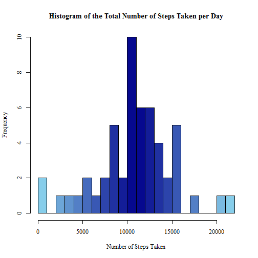
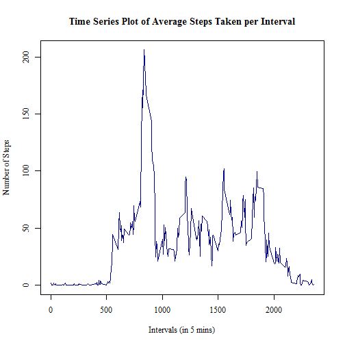
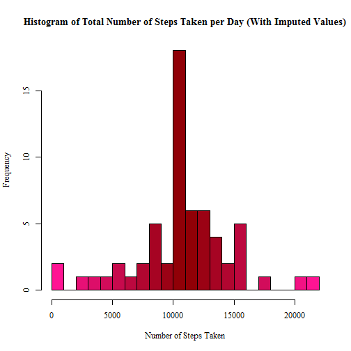
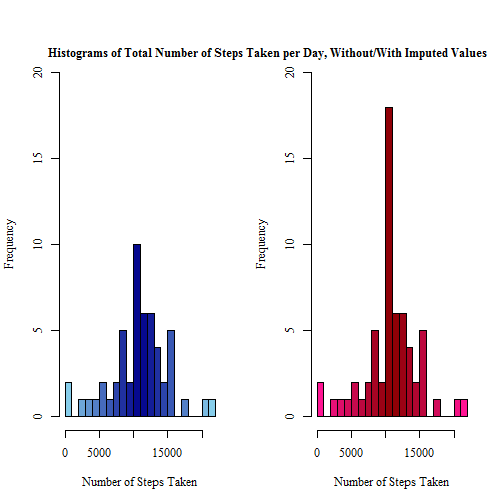
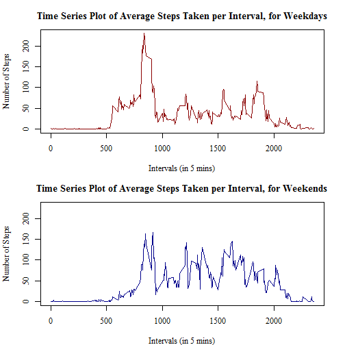

## Introduction

This is an R Markdown document, created for the Coursera course "Reproducible Research", in completion of "Peer Assessment 1". The assignment requires students to write an R markdown document evidencing literate programming, using markdown and R programming techniques. There are 5 primary questions to be answered, dealing with processing and analysing data. The data provided to be worked upon, is called "activity monitoring data".

### The Data

The data provided for use, is derived from a study whereupon a single individual wore a "personal activity monitoring device". The study says that:

> "[Activity monitoring devices] are part of the “quantified self” movement – a group of enthusiasts who take measurements about themselves regularly to improve their health, to find patterns in their behavior, or because they are tech geeks. But these data remain under-utilized both because the raw data are hard to obtain and there is a lack of statistical methods and software for processing and interpreting the data."

The device used in this particular data set collects data on the number of steps taken by an individual, in 5 minute intervals. Two months of data, October/November 2012 are included within the data set. The variables measured include steps (the number of steps taken), date (the day on which the steps measurement was taken) and interval, (the interval in which the steps measurement was taken.) The data is stored in csv format, with 17,598 observations and the aforementioned 3 variables recorded.

## Completing the Assignment

### Question 1: Loading and preprocessing the data

The data must be in the user's current working directory for the code to run correctly. The unzip function extracts the data from the zip file, before it is read into R. The object classes contained within each of the variables are defined, so as to speed up the reading process.


```r
unzip("activity.zip")
initialData <- read.csv("activity.csv", colClasses=c("numeric", "Date", "numeric"))
```

An initial look at the data confirms its dimensions and contents.


```r
head(initialData)
```

```
##   steps       date interval
## 1    NA 2012-10-01        0
## 2    NA 2012-10-01        5
## 3    NA 2012-10-01       10
## 4    NA 2012-10-01       15
## 5    NA 2012-10-01       20
## 6    NA 2012-10-01       25
```

```r
str(initialData)
```

```
## 'data.frame':	17568 obs. of  3 variables:
##  $ steps   : num  NA NA NA NA NA NA NA NA NA NA ...
##  $ date    : Date, format: "2012-10-01" "2012-10-01" ...
##  $ interval: num  0 5 10 15 20 25 30 35 40 45 ...
```

### Question 2: What is mean total number of steps taken per day?

The question states any missing values in the data set can be ignored. From using the summary functions previously, it is already known that there are NA values within the steps variable, so these can be removed now.


```r
data <- initialData[!(is.na(initialData$steps)), ]
```

To calculate the total number of steps taken per day, the data first needs to be grouped separately for each day, and then the sum of each group calculated. The aggregate function can complete both of these steps, and format the output in a tidy data frame.


```r
totalStepsDay <- aggregate(steps ~ date, data, sum)
head(totalStepsDay)
```

```
##         date steps
## 1 2012-10-02   126
## 2 2012-10-03 11352
## 3 2012-10-04 12116
## 4 2012-10-05 13294
## 5 2012-10-06 15420
## 6 2012-10-07 11015
```

Creating exploratory plots are useful to be able to quickly see a view of all of the data, and pick out any potential patterns. Here, a histogram is created to indicate the frequency of total steps taken each day.


```r
paletteBlue <- colorRampPalette(c("skyblue", "darkblue", "skyblue"))
hist(totalStepsDay$steps, breaks=20, xlab="Number of Steps Taken", 
     main="Histogram of the Total Number of Steps Taken per Day",
     col=paletteBlue(22), family="serif")
```

 

Finally, the summarise function can calculate the mean and median values of the total number of steps taken per day.


```r
library(dplyr)
totalStepsSummary <- summarise(totalStepsDay, meanOfTotalSteps=mean(totalStepsDay$steps),
                               medianOfTotalSteps=median(totalStepsDay$steps))
print(totalStepsSummary)
```

```
##   meanOfTotalSteps medianOfTotalSteps
## 1         10766.19              10765
```

Therefore the mean value calculated is **10766.19**, and the median value **10765**.

### Question 3: What is the average daily activity pattern?

To look at the average daily pattern, we can use another exploratory graph, this time a time series plot. As this plot should look at the average number of steps taken for each interval, (utilising all days), the aggregate function must be used again, to split the data into groups for each interval, and then averaged with the mean function.


```r
meanStepsInterval <- aggregate(steps ~ interval, data, mean)
head(meanStepsInterval)
```

```
##   interval     steps
## 1        0 1.7169811
## 2        5 0.3396226
## 3       10 0.1320755
## 4       15 0.1509434
## 5       20 0.0754717
## 6       25 2.0943396
```

The base R plotting system is used to create a time series plot, with each interval on the x axis, and the average steps data on the y axis.


```r
plot(x=meanStepsInterval$interval, y=meanStepsInterval$steps, type="l",
     main="Time Series Plot of Average Steps Taken per Interval",
     ylab="Number of Steps", xlab="Intervals (in 5 mins)",
     col="darkblue", lwd=1.5, family="serif")
```

 

The last part of this question asks "which five minute interval contains the maximum number of steps?" To answer this the max function can be used, which prints out the maximum value from a numeric vector.


```r
meanStepsInterval[grep(max(meanStepsInterval$steps), meanStepsInterval$steps), ]
```

```
##     interval    steps
## 104      835 206.1698
```

So the interval with the maximum number of steps is interval **835**.

### Question 4: Imputing missing values

As the data can be confirmed to contain some NA values as some of the observations:


```r
anyNA(initialData)
```

```
## [1] TRUE
```

It is necessary to find out whether the NA values are more-so clustered to one area within the data. Looking at each of the variables:


```r
data.frame(steps=sum(is.na(initialData$steps)), 
           interval=sum(is.na(initialData$interval)), 
           date=sum(is.na(initialData$date)))
```

```
##   steps interval date
## 1  2304        0    0
```

It can be seen that all 2304 NA values are contained within the steps variable.

Therefore an imputing strategy must be devised to replace all of these missing values with usable numeric measurements. To do so, I decided to replace each missing value with the mean value for the same interval, averaged across all days.

I used a for loop to achieve this, first testing if each observation was an NA value, and if so, replacing it with the mean average for that interval, (as calculated in a previous question).


```r
imputedData <- initialData
for(x in 1:17568) {
    if(is.na(imputedData[x, 1])==TRUE) {
        imputedData[x, 1] <- meanStepsInterval[meanStepsInterval$interval %in% imputedData[x, 3], 2]
    }
}
head(imputedData)
```

```
##       steps       date interval
## 1 1.7169811 2012-10-01        0
## 2 0.3396226 2012-10-01        5
## 3 0.1320755 2012-10-01       10
## 4 0.1509434 2012-10-01       15
## 5 0.0754717 2012-10-01       20
## 6 2.0943396 2012-10-01       25
```

Now that the NA values have been replaced, a histogram from the imputed data can be created. This histogram should indicate the frequency of the total number of steps taken per day. Therefore again, the data must be grouped and "summed" by day.


```r
imputedTotalStepsDay <- aggregate(steps ~ date, imputedData, sum)
head(imputedTotalStepsDay)
```

```
##         date    steps
## 1 2012-10-01 10766.19
## 2 2012-10-02   126.00
## 3 2012-10-03 11352.00
## 4 2012-10-04 12116.00
## 5 2012-10-05 13294.00
## 6 2012-10-06 15420.00
```

Creating the histogram:


```r
paletteRed <- colorRampPalette(c("deeppink", "darkred", "deeppink"))
hist(imputedTotalStepsDay$steps, breaks=20, xlab="Number of Steps Taken", 
     main="Histogram of Total Number of Steps Taken per Day (With Imputed Values)",
     col=paletteRed(22), family="serif")
```

 

The question then asks for calculation of the mean and median total number of steps taken per day, which can be calculated using the summarise function.


```r
imputedStepsSummary <- summarise(imputedTotalStepsDay, 
                                 meanOfTotalSteps=mean(imputedTotalStepsDay$steps), 
                                 medianOfTotalSteps=median(imputedTotalStepsDay$steps))  
print(imputedStepsSummary)
```

```
##   meanOfTotalSteps medianOfTotalSteps
## 1         10766.19           10766.19
```

This a similar calculation to the one completed at the start of the assignment, (without the imputed values,) and thus they can be compared.


```r
rbind(totalStepsSummary, imputedTotalStepsSummary)
```

```
##   meanOfTotalSteps medianOfTotalSteps
## 1         10766.19           10765.00
## 2         10766.19           10766.19
```

The values of the two data sets are very similar, if not exactly the same, due to the use of averaging functions when imputing the NA measurements. The mean values are the same, at **10766.19** steps, while the median value is slightly larger for the imputed data set, at **10766.19** steps, rather than **10765** steps.

If histograms of the two data sets (imputed and non-imputed) are compared:


```r
par(mfrow = c(1, 2))

hist(totalStepsDay$steps, breaks=20, xlab="Number of Steps Taken", 
     col=paletteBlue(22), family="serif", ylim=c(0, 20), main=NULL)
hist(imputedTotalStepsDay$steps, breaks=20, xlab="Number of Steps Taken", 
     col=paletteRed(22), family="serif", ylim=c(0, 20), main=NULL)
mtext("Histograms of Total Number of Steps Taken per Day, Without/With Imputed Values",
      adj=0.95, family="serif", font=2)
```

 

It can be seen that the frequency of values increases in the second histogram, which is expected, due to the imputed values. 

More explanations for the differences between the non and imputed data sets can be seen by looking at the NA values grouped by their date variable.


```r
naByDate <- initialData[is.na(initialData$steps), ]
table(naByDate$date)
```

```
## 
## 2012-10-01 2012-10-08 2012-11-01 2012-11-04 2012-11-09 2012-11-10 
##        288        288        288        288        288        288 
## 2012-11-14 2012-11-30 
##        288        288
```

As there are exactly 288 intervals measured for each day:


```r
length(unique(data$interval))
```

```
## [1] 288
```

It is therefore shown by the above table, that in the initial data set, missing observations are due to entirely missed days, (8 of the days) where no measurements were made whatsoever. This therefore reinforces that the imputing technique used, of utilising average interval data, was likely more useful than potentially using average daily data.

### Question 5: Are there differences in activity patterns between weekdays and weekends?

The question indicates that the imputed data set should be used to answer this problem.  
To help in answering this question, firstly a new factor variable should be created within the data frame. This should indicate whether each day is a "weekday" or a "weekend".

To achieve this, I used the weekdays function to automatically calculate the day of the week each day resided upon, (Monday, Tuesday, etc.) Next, I wrote a for loop, which would assign the factor value "weekend" to all rows it read as having the values "Saturday" or "Sunday", and assign "weekday" to the others.


```r
daysData <- imputedData
daysData$days <- weekdays(daysData$date)
daysData$weekday <- as.character(rep(0, times=17568))
for(x in 1:17568) {
    if(daysData[x, 4] %in% c("Saturday", "Sunday")) {
        daysData[x, 5] <- "weekend"
    } else {
        daysData[x, 5] <- "weekday"
    }
}
daysData$weekday <- factor(daysData$weekday)
head(daysData)
```

```
##       steps       date interval   days weekday
## 1 1.7169811 2012-10-01        0 Monday weekday
## 2 0.3396226 2012-10-01        5 Monday weekday
## 3 0.1320755 2012-10-01       10 Monday weekday
## 4 0.1509434 2012-10-01       15 Monday weekday
## 5 0.0754717 2012-10-01       20 Monday weekday
## 6 2.0943396 2012-10-01       25 Monday weekday
```

To compare the weekday and weekend data, and create two plots of the average number of steps taken per interval, the data has to be split into two groups of weekday/weekend data, using the newly created variable.


```r
weekdayData <- daysData[daysData$weekday=="weekday", ]
weekendData <- daysData[daysData$weekday=="weekend", ]
```

Next, the average number of steps per interval is calculated, much like it has been done in previous questions.


```r
weekdayMean <- aggregate(steps ~ interval, weekdayData, mean)
weekendMean <- aggregate(steps ~ interval, weekendData, mean)
```

Finally the panel plot is created. The x axis indicates each 5 minute interval, and the y axis shows the average number of steps taken. The two plots are divided into weekday, and weekend data.


```r
par(mfrow=c(2, 1), mar=c(4, 4.1, 3, 2.1))
plot(weekdayMean$interval, weekdayMean$steps, type="l",
     main="Time Series Plot of Average Steps Taken per Interval, for Weekdays",
     xlab="Intervals (in 5 mins)", ylab="Number of Steps", family="serif",
     col="darkred", lwd=1.5, ylim=c(0, 230))
plot(weekendMean$interval, weekendMean$steps, type="l",
     main="Time Series Plot of Average Steps Taken per Interval, for Weekends",
     xlab="Intervals (in 5 mins)", ylab="Number of Steps", family="serif",
     col="darkblue", lwd=1.5, ylim=c(0, 230))
```

 
